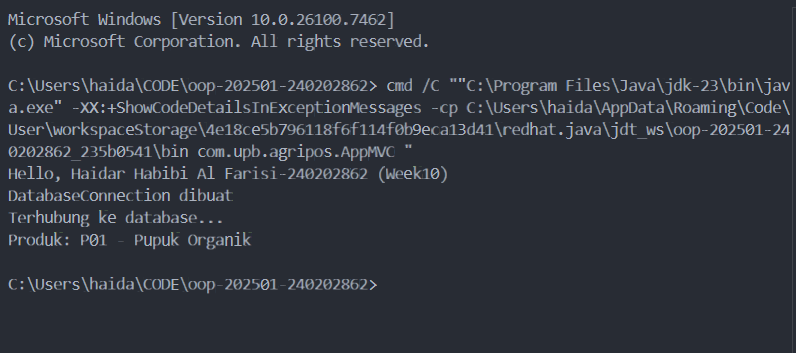

# Laporan Praktikum Minggu 10  
Topik: Design Pattern (Singleton, MVC) dan Unit Testing menggunakan JUnit

## Identitas
- Nama  : Haidar Habibi Al Farisi
- NIM   : 240202862
- Kelas : 3IKRA

---

## Tujuan
(Tuliskan tujuan praktikum minggu ini.  
 *Tujuan dari praktikum minggu ke-10 ini adalah agar mahasiswa memahami konsep design pattern dalam rekayasa perangkat lunak, khususnya Singleton Pattern dan Model–View–Controller (MVC), serta mampu menerapkan unit testing menggunakan JUnit untuk memastikan kualitas dan kebenaran program.*)

---

## Dasar Teori
(Tuliskan ringkasan teori singkat (3–5 poin) yang mendasari praktikum.  
Contoh:  
1. Design Pattern merupakan solusi umum yang telah teruji untuk menyelesaikan permasalahan desain perangkat lunak.  
2. Singleton Pattern memastikan sebuah class hanya memiliki satu instance selama aplikasi berjalan.  
3. MVC (Model–View–Controller) memisahkan logika data, tampilan, dan pengendali agar kode lebih terstruktur.  
4. Unit testing digunakan untuk menguji unit terkecil dari program secara terisolasi.  
5. JUnit adalah framework testing yang umum digunakan pada bahasa pemrograman Java.
)

---

## Langkah Praktikum
(Tuliskan Langkah-langkah dalam prakrikum, contoh:
1. Membuat class `DatabaseConnection` menggunakan Singleton Pattern.  
2. Mengimplementasikan struktur MVC sederhana pada fitur Product.  
3. Membuat class `Product`, `ConsoleView`, dan `ProductController`.  
4. Membuat unit test menggunakan JUnit untuk menguji class `Product`.  
5. Menjalankan program dan unit test menggunakan Maven.
6. Commit message yang digunakan:week10-pattern-testing: implement singleton, mvc, and junit test
)

---
## Implementasi Program

```java
//Singleton – DatabaseConnection
package com.upb.agripos.config;

public class DatabaseConnection {
    private static DatabaseConnection instance;

    private DatabaseConnection() {}

    public static DatabaseConnection getInstance() {
        if (instance == null) {
            instance = new DatabaseConnection();
        }
        return instance;
    }
}

//model 
package com.upb.agripos.model;

public class Product {
    private String code;
    private String name;

    public Product(String code, String name) {
        this.code = code;
        this.name = name;
    }

    public String getCode() {
        return code;
    }

    public String getName() {
        return name;
    }
}
 

 //consoleview
package com.upb.agripos.view;

public class ConsoleView {
    public void showMessage(String message) {
        System.out.println(message);
    }
}

//controller
package com.upb.agripos.controller;

import com.upb.agripos.model.Product;
import com.upb.agripos.view.ConsoleView;

public class ProductController {
    private final Product model;
    private final ConsoleView view;

    public ProductController(Product model, ConsoleView view) {
        this.model = model;
        this.view = view;
    }

    public void showProduct() {
        view.showMessage("Produk: " + model.getCode() + " - " + model.getName());
    }
}

// product test
package com.upb.agripos.model;

import static org.junit.jupiter.api.Assertions.assertEquals;
import org.junit.jupiter.api.Test;

public class ProductTest {

    @Test
    public void testProductName() {
        Product product = new Product("P01", "Benih Jagung");
        assertEquals("Benih Jagung", product.getName());
    }

    @Test
    public void testProductCode() {
        Product product = new Product("P02", "Pupuk Cair");
        assertEquals("P02", product.getCode());
    }
}
```
---

## Hasil Eksekusi
(Program berhasil dijalankan dan unit test menggunakan JUnit berhasil dieksekusi tanpa error.


)
---

## Analisis

Program menerapkan Singleton Pattern untuk memastikan koneksi database hanya dibuat satu kali.
Pola MVC memisahkan tanggung jawab antara data (Model), tampilan (View), dan pengendali (Controller) sehingga kode lebih rapi dan mudah dipelihara.
Unit testing dengan JUnit membantu memastikan bahwa method pada class Product berjalan sesuai dengan yang diharapkan.
Kendala yang dihadapi adalah error konfigurasi package dan Maven, yang diatasi dengan menyesuaikan struktur direktori dan package declaration.

---

## Kesimpulan
(*Dengan menerapkan Singleton Pattern, MVC, dan unit testing menggunakan JUnit, aplikasi menjadi lebih terstruktur, mudah dikembangkan, dan memiliki kualitas kode yang lebih baik serta lebih mudah diuji.*)

---

## Quiz
(1. Mengapa constructor pada Singleton harus bersifat private? 
   **Jawaban:** Agar object tidak dapat dibuat langsung dari luar class dan hanya dapat diakses melalui method getInstance().  

2. Apa manfaat penerapan MVC?
   **Jawaban:**Agar kode lebih terstruktur, mudah dipelihara, dan memudahkan pengembangan serta pengujian.

3. Apa peran unit testing dalam pengembangan perangkat lunak?
   **Jawaban:** Untuk memastikan setiap bagian kecil dari program berjalan dengan benar dan mendeteksi bug sejak dini. )
