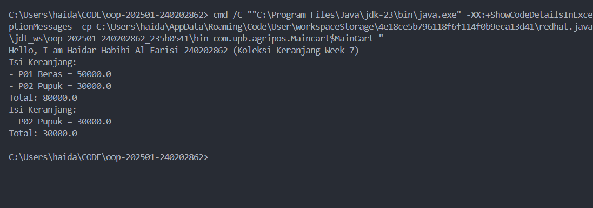

# Laporan Praktikum Minggu 1 (sesuaikan minggu ke berapa?)
Topik: [Tuliskan judul topik, misalnya "Class dan Object"]

## Identitas
- Nama  : Haidar Habibi Al Farisi
- NIM   : 240202862
- Kelas : 3IKRA

---

## Tujuan
(Tuliskan tujuan praktikum minggu ini.  
Contoh: *Mahasiswa memahami konsep class dan object serta dapat membuat class Produk dengan enkapsulasi.*)

---

## Dasar Teori
(Tuliskan ringkasan teori singkat (3–5 poin) yang mendasari praktikum.  
Contoh:  
1. Class adalah blueprint dari objek.  
2. Object adalah instansiasi dari class.  
3. Enkapsulasi digunakan untuk menyembunyikan data.)

---

## Langkah Praktikum
(Tuliskan Langkah-langkah dalam prakrikum, contoh:
1. Langkah-langkah yang dilakukan (setup, coding, run).  
2. File/kode yang dibuat.  
3. Commit message yang digunakan.)

---

## Kode Utama
(Tuliskan kode utama yang dibuat, contoh:  

```java

package com.upb.agripos;
// main product untuk menjalankan program
public class Maincart {
    public class MainCart {
    public static void main(String[] args) {
        // menampilkan informasi diri
        System.out.println("Hello, I am Haidar Habibi Al Farisi-240202862 (Koleksi Keranjang Week 7)");
        // membuat objek produk dengan variabel p1 dan p2
        Product p1 = new Product("P01", "Beras", 50000);
        Product p2 = new Product("P02", "Pupuk", 30000);
        // membuat objek keranjang belanja
        ShoppingCart cart = new ShoppingCart();
        // memamnggil fungsi dari shoppingcart
        cart.addProduct(p1);
        cart.addProduct(p2);
        cart.printCart();

        cart.removeProduct(p1);
        cart.printCart();
    }
}
}

```
)
---

## Hasil Eksekusi
(Sertakan screenshot hasil eksekusi program.  

)
---

## Analisis
(
- Jelaskan bagaimana kode berjalan.  
- Apa perbedaan pendekatan minggu ini dibanding minggu sebelumnya.  
- Kendala yang dihadapi dan cara mengatasinya.  
)
---

## Kesimpulan
(Tuliskan kesimpulan dari praktikum minggu ini.  
Contoh: *Dengan menggunakan class dan object, program menjadi lebih terstruktur dan mudah dikembangkan.*)

---

## Quiz
(1. [Tuliskan kembali pertanyaan 1 dari panduan]  
   **Jawaban:** …  

2. [Tuliskan kembali pertanyaan 2 dari panduan]  
   **Jawaban:** …  

3. [Tuliskan kembali pertanyaan 3 dari panduan]  
   **Jawaban:** …  )
